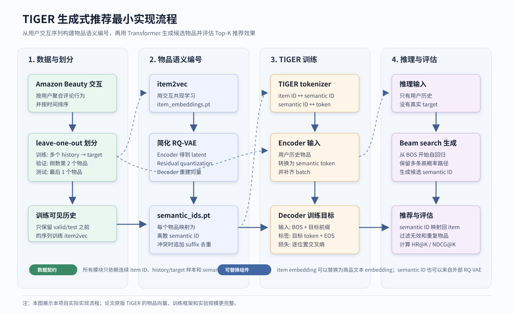

# TIGER 生成式推荐最小实现

这是对 TIGER 生成式推荐的一版最小实现。项目从 Amazon Beauty 交互数据出发，串起用户序列构建、item2vec 物品向量、简化 RQ-VAE 生成 semantic ID（物品的离散语义编号）、Transformer 训练、beam search 推理和 HR/NDCG 评估。实现重点是把关键数据流和模块边界跑通，实验结果不与论文完整配置直接对齐。

完整流程见 [项目原理图](#3-项目原理图)。

## 1. TIGER 原理

TIGER 来自论文 [Recommender Systems with Generative Retrieval](https://arxiv.org/abs/2305.05065)。它的核心思想是：把推荐任务从“对候选物品打分”转成“生成目标物品的语义编号”。

传统召回/排序范式通常先生成候选物品，再用相似度或排序模型给候选打分。TIGER 的思路不同：它先把物品转成可生成的 semantic ID，再让序列模型根据用户历史生成下一个物品的 semantic ID。

这个过程可以拆成两个阶段：

| 阶段 | 输入 | 输出 | 作用 |
| --- | --- | --- | --- |
| 物品编号构建 | 物品表示向量 | `item_id -> semantic ID` | 把原始物品映射成离散 token 序列 |
| 生成式检索 | 用户历史物品对应的 semantic token 序列 | 下一个物品的 semantic ID | 像生成文本一样生成候选物品编号 |

实际推荐时，流程是：

1. 离线阶段先得到每个物品的 semantic ID，并建立 `semantic ID -> item_id` 的反查表。
2. 在线或评估阶段把用户历史物品查表转换成 semantic token 序列，送入 Transformer encoder。
3. Transformer decoder 从 `BOS` 开始自回归生成目标物品的 semantic token。
4. beam search 保留多条高概率生成路径，再把生成出的 semantic ID 映射回真实物品。

也就是说，模型最终不是直接输出某个物品的分类概率，而是像语言模型生成词一样，逐步生成目标物品的离散语义编号。

### 1.1 为什么不直接生成原始物品 ID

如果直接把原始物品 ID 当成生成目标，会有两个问题：

- 原始 ID 通常只是数据库编号，不包含语义关系。
- 物品数量很大，直接做大规模分类会非常稀疏。

TIGER 用 semantic ID 代替原始物品 ID。理想情况下，相似物品会共享一部分语义编号结构，模型学习的是更结构化的物品表示。

### 1.2 semantic ID 是什么

semantic ID 可以理解为物品的离散语义编号。例如：

```text
item_123 -> [12, 5, 98, 3]
```

其中前几位来自 RQ-VAE 的多层量化结果，最后一位在本项目中用于处理重复编号。

用户历史会从：

```text
[item_a, item_b, item_c]
```

变成：

```text
[semantic(item_a), semantic(item_b), semantic(item_c)]
```

然后 Transformer 根据这段语义编号序列生成下一个物品的 semantic ID。

### 1.3 RQ-VAE 的作用

RQ-VAE 在 TIGER 中相当于物品 tokenizer。它负责把连续的物品向量离散化成多层编号：

```text
item embedding -> encoder -> latent vector
latent vector -> residual quantization -> [code_1, code_2, code_3]
codes -> decoder -> reconstructed embedding
```

训练目标是让量化后的编号尽量保留原物品向量的信息。这样每个物品都可以被表示成一串离散 token，后续 Transformer 就可以像处理文本 token 一样处理物品序列。

### 1.4 训练和推理

训练时，模型看到的是：

```text
输入: 用户历史物品的 semantic token 序列
目标: 下一个物品的 semantic token 序列
```

例如：

```text
history: [item_1, item_2, item_3]
target:  item_4
```

会被转换成：

```text
encoder input:
semantic(item_1), semantic(item_2), semantic(item_3)

decoder input:
BOS, token_1(item_4), token_2(item_4), ...

decoder label:
token_1(item_4), token_2(item_4), ..., EOS
```

推理时没有真实 target，模型只有用户历史：

```text
history -> encoder
BOS -> decoder -> 第 1 个 semantic token
已有 token -> decoder -> 第 2 个 semantic token
...
```

为了得到多个推荐候选，本项目使用 beam search。模型会保留多条概率较高的 semantic ID 候选，再把这些编号映射回真实物品，得到 Top-K 推荐结果。

## 2. 本项目实现方案

本项目保留 TIGER 的核心数据流，并对物品表示来源、RQ-VAE 训练规模和模型训练配置做了简化，便于在本地环境完成端到端实验。

### 2.1 数据处理

输入是 Amazon Beauty 原始评论数据。程序按用户聚合交互，并按时间排序得到物品序列。

过滤长度小于 5 的用户后，采用 leave-one-out 划分：

```text
原始序列: [i1, i2, i3, i4, i5, i6]

train:
[i1] -> i2
[i1, i2] -> i3
[i1, i2, i3] -> i4

valid:
[i1, i2, i3, i4] -> i5

test:
[i1, i2, i3, i4, i5] -> i6
```

其中验证集和测试集每个用户只有一个真实目标物品，因此 HR@K 表示真实的下一个物品是否出现在 Top-K 推荐结果里。

为了避免信息泄漏，item2vec 只使用训练阶段可见的历史序列，不使用验证集和测试集目标物品。

### 2.2 物品向量：item2vec

论文原版 TIGER 使用商品文本信息构造物品向量。本项目第一版没有接入商品标题、类目、品牌等文本信息，而是用用户交互序列训练 item2vec。

item2vec 从共现行为中学习物品向量：

```text
用户序列 -> 正样本 pair(center_item, context_item)
center item + 正样本 context + 负样本 item
-> Skip-Gram Negative Sampling
-> item_embeddings.pt
```

得到的 `item_embeddings.pt` 形状是：

```text
[num_items, embedding_dim]
```

第 `i` 行就是内部物品 ID 为 `i` 的向量。

### 2.3 物品 tokenizer：简化 RQ-VAE

本项目实现了一个简化版 RQ-VAE：

```text
item embedding
-> MLP encoder
-> residual quantization
-> MLP decoder
-> reconstruction loss + quantizer loss
```

码本使用 KMeans 初始化。训练结束后导出：

```text
base_semantic_ids.pt
semantic_ids.pt
semantic_id_meta.json
```

其中 `base_semantic_ids.pt` 是 RQ-VAE 原始编号，`semantic_ids.pt` 是去重后的最终编号。

需要去重的原因是：多个物品可能被 RQ-VAE 量化成完全相同的编号。如果不处理，推理时一个 semantic ID 无法唯一映射回一个物品。因此本项目会在原始编号后追加 suffix，让每个物品的 semantic ID 唯一。

### 2.4 TIGER tokenizer

TIGER tokenizer 负责在三种表示之间转换：

```text
真实物品 ID
semantic ID
Transformer token
```

本项目使用分层 token 空间。例如 `codebook_size=256`、`num_quantizer_layers=3` 时：

```text
PAD = 0
BOS = 1
EOS = 2

第 1 层 code token: 3 ~ 258
第 2 层 code token: 259 ~ 514
第 3 层 code token: 515 ~ 770
suffix token:      771 ~ ...
```

这样不同位置的 code 不会混在同一个 token 空间里。

### 2.5 TIGER 模型

本项目使用 PyTorch `nn.Transformer` 实现 encoder-decoder 结构：

```text
encoder input:
用户历史 semantic token 序列

decoder input:
BOS + 目标物品 semantic tokens

labels:
目标物品 semantic tokens + EOS
```

训练时使用交叉熵损失，让模型逐位置预测目标物品的 semantic token。

推理时使用 beam search：

```text
history -> encoder memory
BOS -> decoder
逐层生成 semantic token
保留 beam_size 条候选
semantic ID -> 真实物品 ID
过滤无效和重复物品
输出 Top-K
```

推理阶段做了一个简单优化：用户历史只跑一次 encoder，beam search 的每一步复用 encoder memory，只重复运行 decoder。

## 3. 项目原理图

下面这张图对应本项目的实际实现流程，不代表论文原版 TIGER 的完整工程配置。



图中的关键点：

- `item2vec` 和 `RQ-VAE` 负责把真实物品变成可生成的 semantic ID。
- `TIGER tokenizer` 负责在真实物品 ID、semantic ID 和 Transformer token 之间转换。
- 训练时 decoder 能看到真实目标物品的前缀，学习预测下一个 semantic token。
- 推理时没有目标物品，只从 `BOS` 开始用 beam search 逐步生成 semantic ID。
- 最终必须把生成出的 semantic ID 映射回真实物品，才能计算推荐指标。

## 4. 与论文原版 TIGER 的区别

本项目是面向本地实验的最小实现，和论文完整实验配置不同。

| 模块 | 论文原版 TIGER | 本项目 |
| --- | --- | --- |
| 物品向量 | 使用商品文本信息，通过 Sentence-T5 得到内容向量 | 使用 item2vec 从交互序列学习物品向量 |
| semantic ID | 使用 RQ-VAE 对内容向量量化 | 使用简化 RQ-VAE 对 item2vec 向量量化 |
| RQ-VAE 训练 | 训练更充分，codebook 使用更充分 | KMeans 初始化，并进行较少轮数训练 |
| 用户输入 | 用户历史 semantic ID，并加入 user token | 当前只使用用户历史 semantic ID |
| 模型实现 | 使用更完整的 seq2seq 训练框架 | 使用 PyTorch `nn.Transformer` 最小实现 |
| 训练规模 | 训练步数更多，超参数更充分 | 本地小规模训练，重点验证流程闭环 |

因此，本项目不声称复现论文指标。它保留了 TIGER 的主干数据流，重点放在以下几个环节：

- 覆盖 TIGER 将推荐任务转成生成式序列建模的主干流程。
- 实现 item semantic ID 构建、模型训练、beam search 推理和 HR/NDCG 评估。
- 对比生成式推荐和传统召回排序范式在候选生成方式上的差异。

## 5. 目录结构

```text
tiger_min/
  data/
    adapters.py          读取原始 Amazon 数据或已处理序列
    splits.py            构建 history -> target 样本
    build_sequences.py   数据处理入口

  embedding/
    dataset.py           item2vec 正样本构造与负采样数据集
    model.py             Skip-Gram Negative Sampling 模型
    train_item2vec.py    物品向量训练入口

  rqvae/
    model.py             简化 RQ-VAE tokenizer
    semantic_id_dedup.py semantic ID 去重
    train_rqvae.py       RQ-VAE 训练与 semantic ID 导出入口

  tiger/
    tokenizer.py         真实物品 ID 与 semantic token 的转换
    dataset.py           TIGER 训练样本与批次补齐
    model.py             encoder-decoder Transformer
    train_tiger.py       TIGER 训练入口
    inference.py         beam search 推理与 HR / NDCG 评估
```

数据和模型中间结果默认保存在：

```text
data/processed/beauty/
```

`data/` 不提交 Git。

## 6. 环境与依赖

当前本地虚拟环境：

```powershell
E:\TIGER\tiger-repro\Scripts\python.exe
```

安装依赖：

```powershell
E:\TIGER\tiger-repro\Scripts\python.exe -m pip install -r requirements.txt
```

确认 CUDA：

```powershell
E:\TIGER\tiger-repro\Scripts\python.exe -c "import torch; print(torch.cuda.is_available()); print(torch.cuda.get_device_name(0))"
```

## 7. 完整运行流程

先进入项目目录：

```powershell
cd E:\TIGER\tiger-minimal
```

### 7.1 构建 Beauty 数据

数据处理脚本的默认输入是 `data/raw/reviews_Beauty_5.json.gz`，默认输出到 `data/processed/beauty/`。

```powershell
E:\TIGER\tiger-repro\Scripts\python.exe -m tiger_min.data.build_sequences
```

输出文件：

```text
data/processed/beauty/item2vec_sequences.json
data/processed/beauty/item2id.json
data/processed/beauty/user2id.json
data/processed/beauty/splits.pt
data/processed/beauty/data_meta.json
data/processed/beauty/split_meta.json
```

### 7.2 训练 item2vec

item2vec 默认读取 `data/processed/beauty/item2vec_sequences.json`，输出 `data/processed/beauty/item_embeddings.pt`。

```powershell
E:\TIGER\tiger-repro\Scripts\python.exe -m tiger_min.embedding.train_item2vec
```

输出文件：

```text
data/processed/beauty/item_embeddings.pt
data/processed/beauty/item_embedding_meta.json
```

### 7.3 训练 RQ-VAE 并生成 semantic ID

RQ-VAE 默认读取 `item_embeddings.pt` 并把结果保存到 `data/processed/beauty/`。这里保留 `--normalize-embeddings`，因为本项目实验中对 item2vec 向量做了归一化。

```powershell
E:\TIGER\tiger-repro\Scripts\python.exe -m tiger_min.rqvae.train_rqvae --normalize-embeddings
```

输出文件：

```text
data/processed/beauty/rqvae.pt
data/processed/beauty/base_semantic_ids.pt
data/processed/beauty/semantic_ids.pt
data/processed/beauty/semantic_id_meta.json
data/processed/beauty/rqvae_train_meta.json
```

### 7.4 训练 TIGER

TIGER 默认读取 `splits.pt` 和 `semantic_ids.pt`，并保存到 `data/processed/beauty/tiger/`。注意：训练 TIGER 时的 `codebook_size` 和 `num_quantizer_layers` 必须和 RQ-VAE 阶段一致。

```powershell
E:\TIGER\tiger-repro\Scripts\python.exe -m tiger_min.tiger.train_tiger
```

如果要复现当前记录里的 20 轮实验，只需要额外指定训练轮数和输出目录：

```powershell
E:\TIGER\tiger-repro\Scripts\python.exe -m tiger_min.tiger.train_tiger --epochs 20 --output-dir data/processed/beauty/tiger_e20
```

默认输出文件：

```text
data/processed/beauty/tiger/tiger.pt
data/processed/beauty/tiger/tiger_train_meta.json
```

如果指定了 `--output-dir data/processed/beauty/tiger_e20`，同名文件会保存到 `tiger_e20/` 目录下。

### 7.5 验证集评估

```powershell
E:\TIGER\tiger-repro\Scripts\python.exe -m tiger_min.tiger.inference --split valid
```

### 7.6 测试集评估

```powershell
E:\TIGER\tiger-repro\Scripts\python.exe -m tiger_min.tiger.inference --split test --output data/processed/beauty/tiger/eval_test.json
```

如果模型保存在其他目录，只需要改 `--checkpoint` 和 `--output`。

### 7.7 评估指标

当前评估程序会输出以下指标：

```text
HR@1 / NDCG@1
HR@5 / NDCG@5
HR@10 / NDCG@10
HR@20 / NDCG@20
```

README 中主要记录 `HR@5/10/20` 和 `NDCG@5/10/20`。

- `HR@K` 表示真实目标物品是否出现在 Top-K 推荐结果中。
- `NDCG@K` 在命中基础上考虑排名位置，命中越靠前分数越高。
- 本项目的验证集和测试集每个用户只有一个目标物品，因此这里的 `HR@K` 也可以理解为单目标场景下的 `Recall@K`。

## 8. 当前实验记录

全量 Beauty 数据处理结果：

| 指标 | 数值 |
| --- | ---: |
| 用户数 | 22363 |
| 物品数 | 12101 |
| item2vec 使用的交互数 | 153776 |
| 训练样本数 | 131413 |
| 验证样本数 | 22363 |
| 测试样本数 | 22363 |

全量实验结果。下面记录的是训练 20 轮后保存的最佳 checkpoint，其中最佳验证损失出现在第 14 轮。

| 模块 | 结果 |
| --- | --- |
| item2vec | 正样本 pair 数 654300，最终 loss 0.0748 |
| RQ-VAE | 最佳 epoch 5，最佳 loss 0.0036，semantic ID 冲突率 0.3118，最大冲突组大小 7 |
| TIGER | 最佳 epoch 14，最佳验证 loss 1.8335 |

TIGER 推荐指标：

| split | HR@5 | NDCG@5 | HR@10 | NDCG@10 | HR@20 | NDCG@20 |
| --- | ---: | ---: | ---: | ---: | ---: | ---: |
| valid | 0.0288 | 0.0182 | 0.0482 | 0.0245 | 0.0732 | 0.0308 |
| test | 0.0200 | 0.0126 | 0.0356 | 0.0176 | 0.0557 | 0.0227 |

## 9. 注意事项

- `item2vec_sequences.json` 只使用训练可见历史，不使用验证集和测试集目标物品，避免信息泄漏。
- `semantic_ids.pt` 必须覆盖所有物品，包括验证集和测试集中出现的物品。
- RQ-VAE 的 `codebook_size` 改变后，TIGER 训练和推理也必须使用相同的 `codebook_size`。
- `beam_size` 可以大于 `top_k`，这样过滤无效 semantic ID 后更容易凑满 Top-K 推荐。
- 当前评估每个用户只有一个测试目标物品，因此 HR/NDCG 数值偏低是正常现象。
