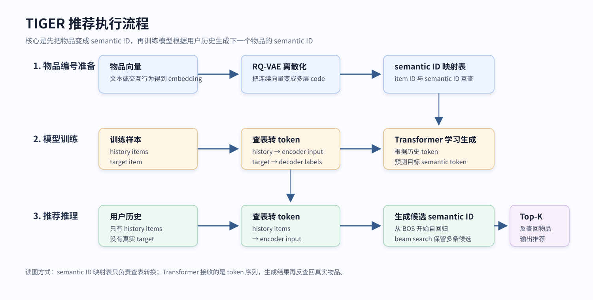

# TIGER 生成式推荐最小实现

**基于 PyTorch 的 TIGER 风格生成式推荐复现项目**

本项目基于 PyTorch 从零实现一条 TIGER 风格的生成式推荐流程，覆盖 item2vec 物品向量、简化 RQ-VAE semantic ID、Tokenizer、Encoder-Decoder Transformer、Beam Search 推理和 HR/NDCG 离线评估。
实验使用 Amazon Beauty 5-core 数据集，处理后包含 22363 个用户、12101 个物品、131413 个训练样本、22363 个验证样本和 22363 个测试样本。
评估时模型需要直接从全部 12101 个物品中生成下一个物品，没有先通过召回模块缩小候选集；在这个设置下，当前测试集 HR@20 为 0.0557，NDCG@20 为 0.0227。
本项目是面向学习和本地复现的非官方最小实现，不追求完全对齐论文原版训练配置或论文指标。

## 目录

- [项目简介](#项目简介)
- [核心实验结果](#核心实验结果)
- [项目流程图](#项目流程图)
- [快速开始](#快速开始)
- [环境与数据集](#环境与数据集)
- [模块说明](#模块说明)
- [与 TIGER 原论文的区别](#与-tiger-原论文的区别)
- [实验配置与结果](#实验配置与结果)
- [局限性与后续工作](#局限性与后续工作)
- [论文引用](#论文引用)
- [致谢](#致谢)

## 项目简介

TIGER 来自论文 [Recommender Systems with Generative Retrieval](https://arxiv.org/abs/2305.05065)。它的核心思想是把推荐任务从“对候选物品打分”改写成“生成目标物品的 semantic ID”。semantic ID 是物品的离散语义编号，例如一个物品可以表示为 `[12, 5, 98, 3]`。

本项目保留 TIGER 的主干执行流程：

1. 用 item2vec 从用户交互序列学习物品向量。
2. 用简化 RQ-VAE 将物品向量离散化为 semantic ID。
3. 将用户历史和目标物品转换成 semantic token 序列。
4. 用 Encoder-Decoder Transformer 学习根据用户历史生成下一个物品的 semantic ID。
5. 推理时用 Beam Search 生成候选 semantic ID，并反查回真实 item ID。

更详细的原理说明放在：

- [TIGER 原理说明](docs/tiger_principle.md)
- [RQ-VAE 与 semantic ID](docs/rqvae_semantic_id.md)
- [Beam Search 推理](docs/beam_search.md)

## 核心实验结果

当前完整实验使用 Amazon Beauty 5-core 全量处理后数据，评估设置为每个用户预测 1 个 next item。这里不是先召回一小批候选物品再排序，而是让模型直接在全部 12101 个物品中生成推荐结果，因此任务难度高于“候选集内排序”设置。

| 数据划分 | HR@5 | NDCG@5 | HR@10 | NDCG@10 | HR@20 | NDCG@20 |
| --- | ---: | ---: | ---: | ---: | ---: | ---: |
| 验证集 | 0.0288 | 0.0182 | 0.0482 | 0.0245 | 0.0732 | 0.0308 |
| 测试集 | 0.0200 | 0.0126 | 0.0356 | 0.0176 | 0.0557 | 0.0227 |

| 指标 | 数值 |
| --- | ---: |
| 用户数 | 22363 |
| 物品数 | 12101 |
| 训练样本数 | 131413 |
| 验证样本数 | 22363 |
| 测试样本数 | 22363 |
| item2vec 物品覆盖率 | 12068 / 12101 = 99.73% |
| 验证集目标物品冷启动比例 | 0.23% |
| 测试集目标物品冷启动比例 | 0.62% |
| Beam size / Top-K | 50 / 20 |
| 平均有效推荐数 | 20.0 |
| 有效推荐率 | 1.0 |

## 项目流程图

### TIGER 原理图



### 项目实现流程图


## 快速开始

所有命令都需要在项目根目录执行：

```powershell
cd tiger-minimal
```

安装依赖：

```powershell
python -m pip install -r requirements.txt
```

准备数据后运行完整流程：

```powershell
python -m tiger_min.data.build_sequences
python -m tiger_min.embedding.train_item2vec
python -m tiger_min.rqvae.train_rqvae --normalize-embeddings
python -m tiger_min.tiger.train_tiger
python -m tiger_min.tiger.inference --split valid
python -m tiger_min.tiger.inference --split test --output data/processed/beauty/tiger/eval_test.json
```

如果要复现实验记录中的 20 轮 TIGER 训练结果：

```powershell
python -m tiger_min.tiger.train_tiger --epochs 20 --output-dir data/processed/beauty/tiger_e20
python -m tiger_min.tiger.inference --checkpoint data/processed/beauty/tiger_e20/tiger.pt --split valid --output data/processed/beauty/tiger_e20/eval_valid_epoch20.json
python -m tiger_min.tiger.inference --checkpoint data/processed/beauty/tiger_e20/tiger.pt --split test --output data/processed/beauty/tiger_e20/eval_test_epoch20.json
```

### 小规模流程测试（Smoke Test）

小规模 smoke test 用于快速检查数据流、训练入口和推理入口能否跑通，不用于报告正式指标。

```powershell
python -m tiger_min.data.build_sequences --max-users 5000 --output data/processed/beauty_5k
python -m tiger_min.embedding.train_item2vec --sequences data/processed/beauty_5k/item2vec_sequences.json --output data/processed/beauty_5k/item_embeddings.pt --epochs 2
python -m tiger_min.rqvae.train_rqvae --item-embeddings data/processed/beauty_5k/item_embeddings.pt --output-dir data/processed/beauty_5k --epochs 2 --normalize-embeddings
python -m tiger_min.tiger.train_tiger --splits data/processed/beauty_5k/splits.pt --semantic-ids data/processed/beauty_5k/semantic_ids.pt --output-dir data/processed/beauty_5k/tiger --epochs 1 --max-train-batches 20 --max-valid-batches 5
python -m tiger_min.tiger.inference --checkpoint data/processed/beauty_5k/tiger/tiger.pt --splits data/processed/beauty_5k/splits.pt --split valid --output data/processed/beauty_5k/tiger/eval_valid.json --max-batches 5
```

## 环境与数据集

### Python 环境

当前复现实验环境：

| 项目 | 数值 |
| --- | --- |
| Python | 3.10.8 |
| PyTorch | 2.6.0+cu126 |
| PyTorch 使用的 CUDA | 12.6 |
| GPU | NVIDIA GeForce RTX 4060 Laptop GPU |
| 显存 | 8 GB |
| NumPy | 2.1.2 |
| scikit-learn | 1.7.2 |
| tqdm | 4.68.3 |

当前 `requirements.txt` 固定为本次实验使用的 CUDA 12.6 PyTorch 环境。

安装依赖：

```powershell
python -m pip install -r requirements.txt
```

如果需要在 CPU 环境运行，可以先按照 [PyTorch Get Started](https://pytorch.org/get-started/locally/) 安装 CPU 版 PyTorch，再安装其余依赖，或按本机环境调整 `requirements.txt` 中的 `torch` 版本。

当前 CUDA 环境对应的 PyTorch 安装方式为：

```powershell
python -m pip install torch --index-url https://download.pytorch.org/whl/cu126
```

### 数据集

本项目使用 Amazon Reviews 2014 版本中的 Beauty 5-core 数据：

| 项目 | 内容 |
| --- | --- |
| 数据集 | Amazon Beauty 5-core |
| 来源 | [Amazon product data, Julian McAuley / UCSD](https://cseweb.ucsd.edu/~jmcauley/datasets/amazon/links.html) |
| 文件名 | `reviews_Beauty_5.json.gz` |
| 放置目录 | `data/raw/reviews_Beauty_5.json.gz` |
| 数据划分 | 按用户序列做 leave-one-out |
| 最小序列长度 | 5 |

数据目录结构：

```text
data/
  raw/
    reviews_Beauty_5.json.gz
  processed/
    beauty/
      item2vec_sequences.json
      item2id.json
      user2id.json
      splits.pt
      data_meta.json
      split_meta.json
      item_embeddings.pt
      semantic_ids.pt
      tiger/
```

`data/` 默认不提交 Git。

## 模块说明

| 模块 | 说明 |
| --- | --- |
| [tiger_min/data/adapters.py](tiger_min/data/adapters.py) | 读取 Amazon 原始数据或已处理序列 |
| [tiger_min/data/splits.py](tiger_min/data/splits.py) | 构建 `history -> target` 样本和 leave-one-out split |
| [tiger_min/data/build_sequences.py](tiger_min/data/build_sequences.py) | 数据处理入口，生成 `splits.pt` 和 item2vec 序列 |
| [tiger_min/data/dataset_stats.py](tiger_min/data/dataset_stats.py) | 统计 item2vec 覆盖率、目标物品覆盖率和冷启动比例 |
| [tiger_min/embedding/dataset.py](tiger_min/embedding/dataset.py) | item2vec 正样本 pair 和负采样数据集 |
| [tiger_min/embedding/model.py](tiger_min/embedding/model.py) | Skip-Gram Negative Sampling 模型 |
| [tiger_min/embedding/train_item2vec.py](tiger_min/embedding/train_item2vec.py) | item2vec 训练入口 |
| [tiger_min/baselines/popular.py](tiger_min/baselines/popular.py) | Popular Baseline 评估入口 |
| [tiger_min/rqvae/model.py](tiger_min/rqvae/model.py) | 简化 RQ-VAE 和 residual quantizer |
| [tiger_min/rqvae/semantic_id_dedup.py](tiger_min/rqvae/semantic_id_dedup.py) | semantic ID 去重和 suffix 追加 |
| [tiger_min/rqvae/train_rqvae.py](tiger_min/rqvae/train_rqvae.py) | RQ-VAE 训练与 semantic ID 导出 |
| [tiger_min/tiger/tokenizer.py](tiger_min/tiger/tokenizer.py) | item ID、semantic ID 和 Transformer token 之间的转换 |
| [tiger_min/tiger/dataset.py](tiger_min/tiger/dataset.py) | TIGER 训练样本和 batch collate |
| [tiger_min/tiger/model.py](tiger_min/tiger/model.py) | Encoder-Decoder Transformer |
| [tiger_min/tiger/train_tiger.py](tiger_min/tiger/train_tiger.py) | TIGER 训练入口 |
| [tiger_min/tiger/inference.py](tiger_min/tiger/inference.py) | Beam Search 推理和 HR/NDCG 评估 |

## 与 TIGER 原论文的区别

| 模块 | TIGER 原论文 | 本项目 |
| --- | --- | --- |
| 物品表示 | 使用商品文本内容向量 | 使用 item2vec 交互向量 |
| 物品 tokenizer | 对内容向量训练 RQ-VAE | 对 item2vec 向量训练简化 RQ-VAE |
| semantic ID 唯一性 | 论文完整系统设计 | RQ-VAE code 后追加 suffix，保证最终 ID 唯一 |
| 用户输入 | 论文完整用户历史 semantic ID 设置 | 当前只使用用户历史 semantic ID |
| 模型实现 | 完整训练框架和更充分调参 | 基于 PyTorch `nn.Transformer` 的最小实现 |
| 推理方式 | 生成式检索 | Beam Search 生成后过滤无效 ID |
| 目标 | 论文级 benchmark | 本地可复现最小实现 |

本项目不声称复现论文完整指标。重点是复现 TIGER 的主干思路和工程闭环。

## 实验配置与结果

### 数据统计

| 指标 | 数值 |
| --- | ---: |
| 用户数 | 22363 |
| 物品数 | 12101 |
| item2vec 使用的交互数 | 153776 |
| 训练样本数 | 131413 |
| 验证样本数 | 22363 |
| 测试样本数 | 22363 |

### 实验配置

| 阶段 | 参数 | 数值 |
| --- | --- | --- |
| 数据 | 最小序列长度 | 5 |
| 数据 | 最大历史长度 | 20 |
| 数据 | 划分方式 | leave-one-out |
| item2vec | embedding 维度 | 256 |
| item2vec | window size | 3 |
| item2vec | 每个正样本的负样本数 | 10 |
| item2vec | batch size | 1024 |
| item2vec | epoch | 15 |
| item2vec | 学习率 | 0.005 |
| RQ-VAE | latent 维度 | 128 |
| RQ-VAE | hidden 维度 | 256 |
| RQ-VAE | 量化层数 | 3 |
| RQ-VAE | codebook size | 256 |
| RQ-VAE | batch size | 1024 |
| RQ-VAE | epoch | 20 |
| RQ-VAE | 学习率 | 0.0005 |
| TIGER | d_model | 192 |
| TIGER | attention heads | 6 |
| TIGER | encoder 层数 | 3 |
| TIGER | decoder 层数 | 3 |
| TIGER | feedforward 维度 | 512 |
| TIGER | dropout | 0.15 |
| TIGER | batch size | 128 |
| TIGER | epoch | 20 |
| TIGER | 学习率 | 0.0003 |
| TIGER | 梯度裁剪 | 1.0 |
| Beam Search | beam size | 50 |
| Beam Search | top_k | 20 |
| Popular Baseline | 排序规则 | 训练可见 item2vec 序列中的全局 Top-K 热门物品 |
| 通用 | 随机种子 | 42 |

### item2vec

| 指标 | 数值 |
| --- | ---: |
| 正样本 pair 数 | 654300 |
| 最终 loss | 0.0748 |
| item2vec 序列中的唯一物品数 | 12068 |
| 物品覆盖率 | 99.73% |

### RQ-VAE 与语义编号（Semantic ID）

| 指标 | 数值 |
| --- | ---: |
| 最佳 epoch | 5 |
| 最佳 loss | 0.0036 |
| 导出时 loss | 0.0036 |
| 原始 semantic ID 长度 | 3 |
| 最终 semantic ID 长度 | 4 |
| 唯一原始 semantic ID 数 | 9969 |
| 追加 suffix 前的原始冲突率 | 31.18% |
| 最大原始冲突组大小 | 7 |
| 追加 suffix 后的最终冲突率 | 0 |

说明：`collision_rate = 0.3118` 是追加 suffix 前的原始 RQ-VAE semantic ID 冲突率。最终用于 TIGER 的 `semantic_ids.pt` 已追加 suffix，因此最终 semantic ID 可以唯一映射回物品。

### TIGER 训练

| 指标 | 数值 |
| --- | ---: |
| 最佳 epoch | 14 |
| 最佳验证 loss | 1.8335 |
| 最终 epoch | 20 |
| 最终训练 loss | 1.5542 |
| 最终验证 loss | 1.8529 |

### 推荐指标

Popular Baseline 指标由下面的程序生成：

```powershell
python -m tiger_min.baselines.popular --processed-dir data/processed/beauty
```

| 模型 | 数据划分 | HR@5 | NDCG@5 | HR@10 | NDCG@10 | HR@20 | NDCG@20 |
| --- | --- | ---: | ---: | ---: | ---: | ---: | ---: |
| TIGER Minimal | 验证集 | 0.0288 | 0.0182 | 0.0482 | 0.0245 | 0.0732 | 0.0308 |
| TIGER Minimal | 测试集 | 0.0200 | 0.0126 | 0.0356 | 0.0176 | 0.0557 | 0.0227 |
| Popular Baseline | 验证集 | 0.0098 | 0.0059 | 0.0163 | 0.0079 | 0.0265 | 0.0104 |
| Popular Baseline | 测试集 | 0.0073 | 0.0040 | 0.0114 | 0.0053 | 0.0195 | 0.0073 |
| ItemKNN | 验证集 | TODO | TODO | TODO | TODO | TODO | TODO |
| ItemKNN | 测试集 | TODO | TODO | TODO | TODO | TODO | TODO |

### 束搜索（Beam Search）有效预测统计

Beam Search 有效预测统计由 `tiger_min.tiger.inference` 在评估时输出：

```powershell
python -m tiger_min.tiger.inference --checkpoint data/processed/beauty/tiger_e20/tiger.pt --split test --output data/processed/beauty/tiger_e20/eval_test_epoch20.json
```

| 数据划分 | Beam size | Top-K | 平均有效推荐数 | 有效推荐率 |
| --- | ---: | ---: | ---: | ---: |
| 验证集 | 50 | 20 | 20.0 | 1.0 |
| 测试集 | 50 | 20 | 20.0 | 1.0 |

### 目标物品覆盖率

item2vec 覆盖率和 valid/test target 冷启动比例由下面的统计程序生成：

```powershell
python -m tiger_min.data.dataset_stats --processed-dir data/processed/beauty
```

| 指标 | 数值 |
| --- | ---: |
| 验证集目标物品覆盖率 | 99.77% |
| 测试集目标物品覆盖率 | 99.38% |
| 验证集目标物品冷启动比例 | 0.23% |
| 测试集目标物品冷启动比例 | 0.62% |

## 局限性与后续工作

- 当前 Beam Search 只按 semantic ID 位置限制 token 范围，生成完成后再过滤无效 semantic ID；尚未实现基于 Trie 的前缀约束搜索。
- 当前 item embedding 来自 item2vec 交互序列，没有接入商品标题、类目、品牌等文本信息。
- 当前已补充 Popular baseline，尚未实现 ItemKNN 等更强序列/共现基线的正式实验结果。
- 当前没有候选集预筛选，模型直接在全部物品空间中生成 next item，任务难度较高。
- 后续可以将 item embedding 来源替换为文本 embedding，并比较交互语义和内容语义对 semantic ID 的影响。
- 后续可以实现 Trie-constrained Beam Search，减少无效 semantic ID 候选。

## 论文引用

如果使用 TIGER 原论文，请引用：

```bibtex
@article{rajput2023recommender,
  title={Recommender Systems with Generative Retrieval},
  author={Rajput, Shashank and Mehta, Nikhil and Singh, Anima and Keshavan, Raghunandan H. and Vu, Trung and Heldt, Lukasz and Hong, Lichan and Tay, Yi and Tran, Vinh Q. and Samost, Jonah and Kula, Maciej and Chi, Ed H. and Sathiamoorthy, Maheswaran},
  journal={arXiv preprint arXiv:2305.05065},
  year={2023}
}
```

## 致谢

- TIGER 原论文：[Recommender Systems with Generative Retrieval](https://arxiv.org/abs/2305.05065)
- Amazon Reviews 数据集：[Amazon product data, Julian McAuley / UCSD](https://cseweb.ucsd.edu/~jmcauley/datasets/amazon/links.html)
- PyTorch 框架：[https://pytorch.org](https://pytorch.org)
